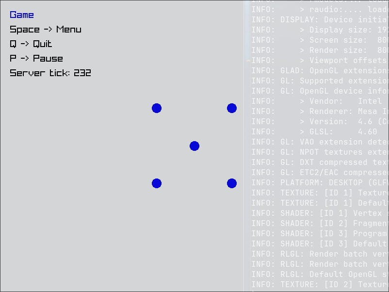

# Architecture

<br>

Layered application architecture with local/remote client-server networking, built with Rust. 🧩 

<br>

A small Rust demo exploring two patterns I wanted to implement and showcase:

1. **Layered application engine** - Stack-based Layer system (menu / game / pause)
   driven by an Application loop, with input bindings, actions, and settings
   abstracted behind generic traits.
2. **Client/server game session** - The same client binary can run a fully
   integrated local server, or connect to a standalone dedicated server binary,
   selected via `settings.json`.

<br>

Powered by Raylib, Hecs, and Renet.

<br>



<br>

***Linux***

Prebuilt binaries available, `architecture` and `dedicated_server`.

**Download:** https://github.com/hexensemble/architecture/releases

<br>

***Other platforms***

Build or run from source with:

```
--bin architecture
--bin dedicated_server
```

<br>

**Usage**

First run of `architecture` will generate a `settings.json` file from where you can configure various options. Default session is local.

To run a remote session change *mode* under *net_settings* from *Local* to *Remote* then run `dedicated_server`. Run `architecture` and it will now connect to the dedicated server.

WASD to move the "player". Spin up a bunch of `architecture` instances to connect more clients.
